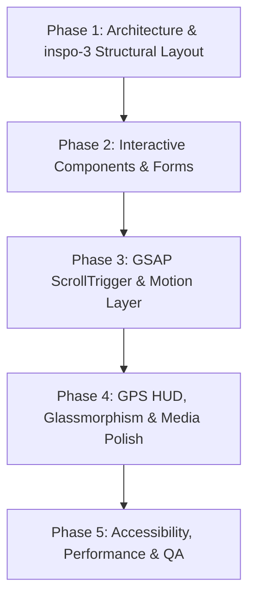

# AHPO Luxury Yacht Charter — Master Design & Implementation Blueprint
> **Reference Design:** `inspo-3.png` — Exact layout, structural composition, typography scale, component hierarchy, and editorial luxury aesthetic.
> **Role Persona:** Senior Product Designer (Apple + Stripe + Linear level), Senior UX Designer, Motion Designer, Frontend Architect, Accessibility Engineer, Interaction Designer & Performance Engineer.

---

## Executive Overview
This document establishes the exhaustive technical and architectural blueprint to rebuild the AHPO Yacht Charter Next.js web application to mirror **`inspo-3.png`** with ultra-luxury fidelity. The design contrasts deep obsidian oceanic zones (`#0A0F17`) with refined warm cream editorial sections (`#F9F8F6`), high-contrast display serif typography, tactile micro-feedbacks, floating HUD elements, and deterministic GSAP/Framer Motion scroll physics.

---

# Section-by-Section Design & Engineering Specifications

---

## 1. Hero & Navigation Bar

### 1.1 Purpose
* **Psychological State:** Uncompromised exclusivity, serene grandeur, nautical prestige, and instant intrigue.
* **Visual Anchor (`inspo-3.png`):** Full-viewport aerial perspective of a mega-yacht slicing through deep ocean wake, framed by bold stacked serif typography ("SAIL BEYOND THE ORDINARY"), floating GPS HUD coordinates, and right-aligned yacht counter preview.

### 1.2 User Journey
* **Actions:** Mouse move triggers subtle parallax tilt of the floating GPS HUD badge (`43° 17' 07" N / 09° 22' 47" E`) and featured vessel card (`01/06 AZURE ONE`); hover over top CTA button ("ENQUIRE →") triggers light pill inversion; click "WATCH FILM ▷" opens full-screen cinematic video lightbox; click "EXPLORE FLEET →" initiates smooth inertia scroll to fleet section.

### 1.3 Microinteractions
* **Top Bar "ENQUIRE →" Button:** Cream fill (`#F2EFE9`) with dark text; hover shifts background to bright porcelain (`#FFFFFF`) with arrow sliding +5px right on spring release (`stiffness: 400, damping: 25`).
* **Floating GPS Badge:** Interactive glass circle with crosshair dot; on hover, coordinates subtly illuminate with a gold backlight (`box-shadow: 0 0 20px rgba(212, 175, 55, 0.3)`).
* **Featured Yacht Widget (`01/06 AZURE ONE`):** Clicking "VIEW YACHT" expands mini thumbnail popover (`scale(1.05)`) displaying vessel speed, draft, and specs.
* **Vertical "SCROLL ●" Indicator:** Subtly pulses along the right viewport margin with a continuous slow vertical loop (`y: 0 → 8px → 0` over 2.5s).

### 1.4 Motion Design
* **Entrance Sequence (GSAP Timeline):**
  1. Hero background aerial media: Scales down from `scale(1.1)` to `scale(1.0)` over 1.8s (`ease: "power3.out"`).
  2. Logo ("AHPO YACHTS") & Top Nav: Fade in from `y: -20px` to `0px`, duration 800ms.
  3. Eyebrow ("LUXURY REDEFINED"): Letter-by-letter reveal (12ms stagger, opacity 0 → 1).
  4. Headline ("SAIL BEYOND THE ORDINARY"): Staggered 3-line clip reveal (`inset(100% 0 0 0)` → `inset(0% 0 0 0)`), duration 1.1s, line stagger 140ms, ease `custom-bezier(0.16, 1, 0.3, 1)`.
  5. GPS HUD & Featured Yacht Widget: Fade and scale in from `scale(0.92)` to `scale(1)` at 700ms mark.

### 1.5 Scroll Behaviour
* **Multi-Layered Parallax:**
  * Background ocean video/photo moves at 0.15x scroll speed.
  * Headline text & subhead move at 0.40x scroll speed.
  * GPS HUD & Featured Yacht widget float upwards at 0.60x scroll speed before fading out at 50vh scroll offset.

### 1.6 Typography Behaviour
* **Headline:** Condensed high-contrast Display Serif (all caps, tight vertical line height 0.92, responsive scale `clamp(3rem, 7vw, 6.5rem)`).
* **Subhead & Eyebrow:** Tracking-extended sans-serif (letter-spacing `0.15em`, font-weight 400).

### 1.7 Responsiveness
* **Desktop (1440px+):** Full asymmetrical layout matching `inspo-3.png` exactly (Headline left, GPS center-left, Yacht preview right).
* **Tablet (768px - 1023px):** GPS HUD hides; featured yacht preview stacks beneath headline buttons.
* **Mobile (<768px):** Headline sizes dynamically to 2.75rem; nav links collapse into slide-out glass menu; CTAs convert to full-width touch targets.

### 1.8 Accessibility
* **Contrast Compliance:** White/cream hero text rendered over heavy dark vignette overlay ensuring >7:1 contrast ratio over background ocean media.
* **ARIA Landmarks:** `<header>`, `<nav aria-label="Primary Navigation">`, hero headline marked as single `<h1>`.

### 1.9 Performance
* **LCP Optimization:** Hero ocean image served as highly optimized WebP/AVIF with `<link rel="preload">` priority; video stream initializes after initial render frame.

### 1.10 Technical Implementation
* **Stack:** Next.js App Router + Tailwind CSS + GSAP + ScrollTrigger.
* **Why:** GSAP provides exact frame synchronization for multi-element parallax and line-by-line clip reveals.

---

## 2. Search / Booking Bar

### 2.1 Purpose
* **Psychological State:** Operational precision, high-touch concierge service, frictionless planning.
* **Visual Anchor (`inspo-3.png`):** Grounded light-cream bar (`#F2EFE9`) anchored across the bottom of the hero section, featuring 4 explicit search fields (LOCATION, CHECK IN, CHECK OUT, GUESTS) and a solid dark right button ("CHECK AVAILABILITY →").

### 2.2 User Journey
* **Actions:** Click any segment (opens floating popover date/location selector); hover segment (highlights segment background with subtle off-white shift); click "CHECK AVAILABILITY →" (triggers pre-filtered inquiry submission).

### 2.3 Microinteractions
* **Segment Hover:** Segment background shifts from `#F2EFE9` to `#EBE7E0` with vertical divider lines dimming slightly.
* **Input Icon State:** Map pin, calendar, and guest icons scale slightly `scale(1.1)` and shift color to champagne gold (`#B89543`) on segment focus.
* **"CHECK AVAILABILITY →" CTA:** Hover shifts button background from `#0A0F17` to `#1E293B` with arrow sliding +6px right.

### 2.4 Motion Design
* **Entrance:** Slides up into hero bottom anchor at `delay: 800ms`, y: 40px → 0px, opacity 0 → 1 (`ease: "power3.out"`).
* **Popover Opening:** Popovers scale and fade in from `scale(0.96), opacity: 0` to `scale(1), opacity: 1` in 200ms using `cubic-bezier(0.16, 1, 0.3, 1)`.

### 2.5 Scroll Behaviour
* **Sticky Docking Option:** Upon scrolling past 100vh, booking bar cleanly collapses into a floating bottom pill ("Refine Search") that pins to viewport center-bottom.

### 2.6 Typography Behaviour
* **Field Labels:** Small uppercase sans-serif (`LOCATION`, `CHECK IN`, `CHECK OUT`, `GUESTS`), 10px font size, letter-spacing 0.12em.
* **Value Text:** Clean sans-serif, 14px font size, `#0A0F17` color.

### 2.7 Responsiveness
* **Desktop:** Horizontal 5-column inline bar as shown in `inspo-3.png`.
* **Tablet:** 2x2 grid layout inside light cream card wrapper.
* **Mobile:** Collapsed single-line bar ("Where to? • Dates") opening into a full bottom sheet modal on tap.

### 2.8 Accessibility
* **Keyboard Navigation:** Tab key cycles through fields sequentially; `Space`/`Enter` triggers field popovers; `Escape` closes active popover.

### 2.9 Performance
* **Zero Repaint Overhead:** Popovers positioned using CSS GPU transforms via Floating UI library.

### 2.10 Technical Implementation
* **Stack:** Floating UI + Headless UI Popover + Date-fns.

---

## 3. Fleet Cards Section ("THE FLEET / EXCEPTIONAL BY DESIGN")

### 3.1 Purpose
* **Psychological State:** Aesthetic admiration, luxury desire, confidence in vessel quality.
* **Visual Anchor (`inspo-3.png`):** Light cream background section (`#F9F8F6`). Left column displays eyebrow "THE FLEET", headline "EXCEPTIONAL BY DESIGN", description, "VIEW ALL YACHTS →", and circular carousel arrows `( ← ) ( → )`. Right side displays a 4-card horizontal grid of superyachts with specs and pricing.

### 3.2 User Journey
* **Actions:** Click circular arrow buttons `( ← ) ( → )` or drag horizontally to scroll through vessel cards; hover card (image zooms, `+` button illuminates); click `+` button (opens detailed spec popover).

### 3.3 Microinteractions
* **Popular Badge ("POPULAR"):** Dark badge anchored top-left of image on "AZURE ONE" with a subtle live indicator pulse dot.
* **Card Image Hover:** Image inside container scales smoothly `scale(1.05)` over 600ms (`ease: "power2.out"`).
* **Card Bottom `+` Button:** Hovering the `+` icon rotates it 90 degrees and expands its background fill to dark obsidian.
* **Carousel Arrow Buttons `( ← ) ( → )`:** Hover shifts ring border color from `#D0C9BE` to `#0A0F17` with arrow shifting inside.

### 3.4 Motion Design
* **Section Reveal:** Left copy and right card grid enter with 120ms stagger.
* **Carousel Drag Motion:** Physics-based kinetic scrolling using Embla Carousel spring parameters (`dragFree: true`, `containScroll: "trimSnaps"`).

### 3.5 Scroll Behaviour
* **Horizontal Scroll Snap:** On mobile and tablet, cards snap cleanly to center focus (`scroll-snap-type: x mandatory`).

### 3.6 Typography Behaviour
* **Headline:** "EXCEPTIONAL BY DESIGN" set in elegant serif, line-height 1.05.
* **Vessel Names:** Uppercase serif ("AZURE ONE", "LUNA", "ECLIPSE", "OCEAN PEARL").
* **Specs & Pricing:** Monospaced/sans numeric presentation (`52M • 12 GUESTS • 11 CREW`, `From €150,000 / week`).

### 3.7 Responsiveness
* **Desktop (1440px+):** Asymmetric split layout as in `inspo-3.png` (Left 25% header / Right 75% 4-card carousel grid).
* **Mobile (<768px):** Header stacks on top; carousel becomes full-width swipeable touch slider.

### 3.8 Accessibility
* **Screen Reader Labels:** `aria-label="Yacht carousel. Showing 4 vessels."`. Arrow buttons feature explicit `aria-label="Previous yacht"` and `aria-label="Next yacht"`.

### 3.9 Performance
* **Image Delivery:** Dynamic Responsive Images (`srcset`) loaded via Next.js `<Image>` with webp compression.

### 3.10 Technical Implementation
* **Stack:** Embla Carousel + Framer Motion + Next.js Image.

---

## 4. Destinations Section ("ICONIC PLACES. ENDLESS STORIES.")

### 4.1 Purpose
* **Psychological State:** Coastal wanderlust, exotic anticipation, geographical discovery.
* **Visual Anchor (`inspo-3.png`):** Split layout. Left side (light cream) features headline "ICONIC PLACES. ENDLESS STORIES.", copy, and "EXPLORE DESTINATIONS →". Center features a breathtaking widescreen photo of Mediterranean coastal waters. Right side features a dark obsidian panel listing destinations: `01 THE MEDITERRANEAN`, `02 THE CARIBBEAN`, `03 THE BAHAMAS`, `04 FRENCH POLYNESIA`.

### 4.2 User Journey
* **Actions:** Hover/click any destination in the right dark list (01-04); center landscape image smoothly cross-fades to high-resolution photography of selected region; active destination item highlights with illuminated underline and text weight shift.

### 4.3 Microinteractions
* **Destination Item Hover:** Text moves 10px right; index number ("01", "02") shifts to champagne gold (`#B89543`).
* **Active State Indicator:** Underline expands under active destination (e.g., `01 THE MEDITERRANEAN`), and dark panel right background glows subtly.
* **Center Photography Hover:** Cursor morphs into custom circular floating lens badge ("EXPLORE").

### 4.4 Motion Design
* **Photo Swap Crossfade:** Cross-fade transition between destination photos over 500ms using CSS opacity and GPU acceleration (`will-change: opacity`).
* **Section Entrance:** Left headline slides up from y: 40px; center image expands using clip-path mask (`clip-path: inset(0 100% 0 0)` → `clip-path: inset(0 0 0 0)`), duration 1.2s.

### 4.5 Scroll Behaviour
* **Scroll-Linked Accordion (Desktop):** As user scrolls through the section, destination items auto-advance from 01 to 04 tied to scroll progress percentage via GSAP ScrollTrigger.

### 4.6 Typography Behaviour
* **List Numerals:** Monospaced tabular figures ("01", "02", "03", "04").
* **List Text:** Tracked uppercase sans-serif (`THE MEDITERRANEAN`).

### 4.7 Responsiveness
* **Desktop:** 3-part split screen layout (Left Copy / Center Image / Right Dark Accordion) as in `inspo-3.png`.
* **Mobile:** Stacks into full-width accordion cards with embedded image previews.

### 4.8 Accessibility
* **Keyboard Navigation:** Up/Down arrow keys toggle destination selection in right list; `Enter` activates region details page.

### 4.9 Performance
* **Asset Preloading:** Destination image set preloaded on section viewport entry to avoid blank background render frames.

### 4.10 Technical Implementation
* **Stack:** GSAP ScrollTrigger + Custom React Active State Hook + Next.js Image.

---

## 5. Stats Bar & Feature Banner ("UNMATCHED ONBOARD EXPERIENCES")

### 5.1 Purpose
* **Psychological State:** Trust, scale, proven excellence, and high-end lifestyle reassurance.
* **Visual Anchor (`inspo-3.png`):** Full-width dark obsidian block (`#0A0F17`). Left side displays 4 metric stats separated by thin vertical dividers (`50+ YACHTS WORLDWIDE`, `2M+ HAPPY GUESTS`, `200+ DESTINATIONS`, `24/7 CONCIERGE`). Right side features an overlapping interior yacht lounge photo and text block ("BEYOND THE YACHT / UNMATCHED ONBOARD EXPERIENCES").

### 5.2 User Journey
* **Actions:** Scroll into view triggers animated stat counter roll; hover right feature image (lounge photo subtly zooms); click "DISCOVER MORE →" (opens experiences detail drawer).

### 5.3 Microinteractions
* **Stat Counter Animation:** Numbers count up dynamically (`0 → 50+`, `0 → 2M+`, `0 → 200+`) upon viewport entry over 1.6s.
* **Feature Image Hover:** Interior yacht salon image scales `scale(1.04)` with ambient lighting shimmer.

### 5.4 Motion Design
* **Counter Roll Engine:** GSAP `Snap` plugin or Framer Motion `useSpring` counter animating numerical values smoothly on trigger.
* **Right Banner Slide-In:** Lounge photo card slides in from right with subtle 3D rotation (`rotateY(-5deg)` → `rotateY(0deg)`).

### 5.5 Scroll Behaviour
* **Sticky Reveal:** Stat bar pins momentarily while feature banner slides into place alongside metrics.

### 5.6 Typography Behaviour
* **Stat Numbers:** Large condensed luxury serif (`50+`, `2M+`, `200+`, `24/7`), size 3rem.
* **Stat Labels:** Muted gold/slate uppercase sans-serif.

### 5.7 Responsiveness
* **Desktop:** 4-stat inline grid + right feature card layout as in `inspo-3.png`.
* **Mobile:** 2x2 stats grid; feature card stacks underneath full-width.

### 5.8 Accessibility
* **Static Fallback:** Screen readers read final computed text immediately (`aria-label="50 plus yachts worldwide, 2 million plus happy guests"`).

### 5.9 Performance
* **Counter Thread Safety:** Animation requestAnimationFrame driven without triggering React re-renders for every integer.

### 5.10 Technical Implementation
* **Stack:** GSAP + Framer Motion `useInView` + Tailwind Grid.

---

## 6. Journal / Experiences Section ("FROM THE JOURNAL / MORE THAN A JOURNEY")

### 6.1 Purpose
* **Psychological State:** Storytelling, emotional connection, holistic luxury lifestyle.
* **Visual Anchor (`inspo-3.png`):** Light cream section. Left column displays "FROM THE JOURNAL", "MORE THAN A JOURNEY", description, "DISCOVER EXPERIENCES →". Right side displays 3 card columns (`01 CULINARY JOURNEYS`, `02 ADVENTURE`, `03 RELAXATION`) with photographic cards and `+` action buttons.

### 6.2 User Journey
* **Actions:** Hover cards (image elevates, `+` button rotates); click `+` button (opens experience modal story).

### 6.3 Microinteractions
* **Card Lift:** Card translates `-6px` on Y-axis with soft shadow drop (`box-shadow: 0 15px 30px rgba(0,0,0,0.08)`).
* **Plus Button Interaction:** Rotates 90 degrees on hover with background fill transitioning to obsidian black.

### 6.4 Motion Design
* **Grid Entry Stagger:** 3 cards stagger reveal with 100ms offset, y: 35px → 0px.

### 6.5 Scroll Behaviour
* **Smooth Parallax:** Card images feature subtle internal scroll parallax within their clipped image containers.

### 6.6 Typography Behaviour
* **Card Titles:** Clean serif titles ("CULINARY JOURNEYS", "ADVENTURE", "RELAXATION").
* **Card Sub-text:** Refined sans-serif body copy.

### 6.7 Responsiveness
* **Desktop:** 3-column horizontal grid.
* **Mobile:** Touch horizontal slider.

### 6.8 Accessibility
* **Semantic Cards:** Wrapped in `<article>` with heading targets.

### 6.9 Performance
* **Optimized Card Images:** Responsive Next.js images.

### 6.10 Technical Implementation
* **Stack:** Framer Motion + Tailwind CSS.

---

## 7. Contact Section ("READY TO PLAN YOUR ESCAPE?")

### 7.1 Purpose
* **Psychological State:** Reassurance, direct personal access, elite concierge readiness.
* **Visual Anchor (`inspo-3.png`):** Dark navy/black background block (`#0A0F17`). Left copy: "READY TO PLAN YOUR ESCAPE?". Form inputs: Underlined minimal inputs (`FULL NAME`, `EMAIL ADDRESS`, `PHONE NUMBER`, `DESTINATION OF INTEREST`). Light cream CTA button "SEND ENQUIRY →". Direct contact line: "+377 99 90 90 90".

### 7.2 User Journey
* **Actions:** Focus input field (underline turns gold, floating label moves up); type values; click "SEND ENQUIRY →" (button animates to loading spinner then checkmark); click phone number to dial.

### 7.3 Microinteractions
* **Minimalist Underline Focus:** Bottom border line transforms from `#1E293B` to `#D4AF37` expanding from center outward (`scaleX: 0 → 1`).
* **"SEND ENQUIRY →" Button:** Light cream background (`#F2EFE9`); hover shifts to bright white with arrow sliding +6px right.
* **Phone Link Hover:** Direct phone number (`+377 99 90 90 90`) glows champagne gold on hover.

### 7.4 Motion Design
* **Form Submission Physics:** Button content morphs seamlessly into a loading spinner over 200ms using Framer Motion `layout` animation, then resolves to a checkmark tick with a spring bounce.

### 7.5 Scroll Behaviour
* **Form Entrance:** Form container slides up gracefully as page reaches bottom scroll zone.

### 7.6 Typography Behaviour
* **Input Labels:** Tracked small uppercase sans-serif (`FULL NAME`, `EMAIL ADDRESS`, `PHONE NUMBER`, `DESTINATION OF INTEREST`).

### 7.7 Responsiveness
* **Desktop:** Split layout as in `inspo-3.png`.
* **Mobile:** Full width stacked inputs with large touch targets.

### 7.8 Accessibility
* **WCAG Compliance:** Labels explicitly tied to inputs (`htmlFor`); error states highlighted with high contrast gold/red text and `aria-invalid`.

### 7.9 Performance
* **Uncontrolled Inputs:** Powered by React Hook Form to avoid state re-render lag.

### 7.10 Technical Implementation
* **Stack:** React Hook Form + Zod + Tailwind CSS.

---

## 8. Footer Section

### 8.1 Purpose
* **Psychological State:** Brand permanence, complete trust, structural closure.
* **Visual Anchor (`inspo-3.png`):** Dark obsidian footer bar (`#070A0F`). Left logo "AHPO YACHTS", center navigation links (YACHTS, DESTINATIONS, EXPERIENCES, ABOUT, JOURNAL), right social links (INSTAGRAM, FACEBOOK, LINKEDIN).

### 8.2 User Journey
* **Actions:** Hover navigation links (underline draw animation); hover social links (text highlights); click links to navigate.

### 8.3 Microinteractions
* **Link Underline Draw:** Hover draws a sub-pixel line from left to right under target link text.
* **Social Links:** Hover shifts text from muted slate (`#64748B`) to porcelain white (`#F8FAFC`).

### 8.4 Motion Design
* **Footer Unveil:** Subtle curtain reveal effect as main body content pulls away.

### 8.5 Scroll Behaviour
* **Static Anchor:** Grounded cleanly at document end.

### 8.6 Typography Behaviour
* **Brand Logo & Links:** Uppercase tracked sans-serif matching top header styling.

### 8.7 Responsiveness
* **Desktop:** 3-part horizontal alignment matching `inspo-3.png`.
* **Mobile:** Stacked vertical alignment with centered links.

### 8.8 Accessibility
* **Semantic Tag:** `<footer>` tag with aria labels for social navigation.

### 8.9 Performance
* **Zero JS Footprint:** Rendered purely via standard HTML/CSS.

### 8.10 Technical Implementation
* **Stack:** Tailwind CSS + Next.js Link.

---

# Production Polish & Prioritized Roadmap

---

## 11. Production Polish (Luxury Touches matching `inspo-3.png`)

1. **Dual-Tone Obsidian & Cream Aesthetics:**
   * Exact color token matching: Deep Oceanic Obsidian (`#0A0F17`), Soft Teak Cream (`#F2EFE9`), Light Editorial Off-White (`#F9F8F6`), Champagne Gold (`#D4AF37`).
2. **Lenis Inertia Scrolling:**
   * Integration of `@studio-freight/lenis` for smooth mouse-wheel momentum across the dark/cream section transitions.
3. **GPS Floating HUD & Cursor Lens:**
   * Interactive floating GPS element in hero section and custom contextual cursor lens over media elements.
4. **Subtle Noise Texture:**
   * Global 3.5% opacity SVG grain canvas layer eliminating color banding across dark gradients.

---

## 12. Prioritized Implementation Roadmap

### Phase 1: Architecture & `inspo-3.png` Structural Layout
* Setup exact color tokens, typography system, and recreate all 8 section layouts matching `inspo-3.png` visually.

### Phase 2: Interactive Components & Forms
* Implement booking bar popovers, fleet carousel controls, destination list selection logic, and contact form validation.

### Phase 3: GSAP ScrollTrigger & Motion Layer
* Connect Lenis smooth scroll, hero clip-path reveals, destination scroll pinning, and stat counter animations.

### Phase 4: GPS HUD, Glassmorphism & Media Polish
* Build the floating hero GPS badge, video modal lightbox, custom cursor lens, and grain overlay.

### Phase 5: Accessibility, Performance & QA
* Conduct Lighthouse audits, WCAG contrast verification, ARIA keyboard testing, and cross-browser responsiveness checks.

---
*Blueprint rewritten and precisely aligned with `inspo-3.png`. Ready for implementation.*
